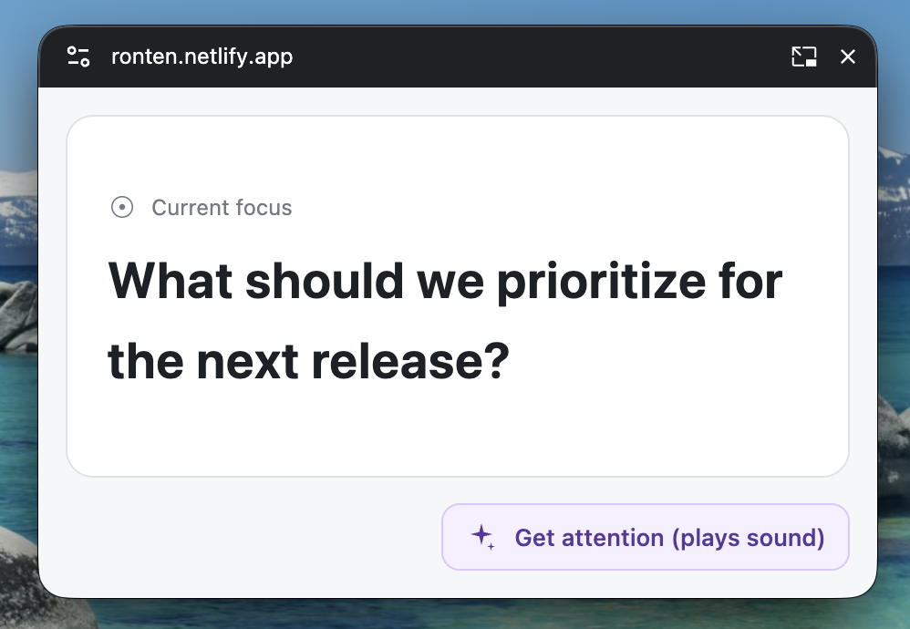

# RONTEN

English · [日本語](README.ja.md) 

A simple tool that keeps your meeting’s focus in a floating window. Each press of “Get attention” randomly shows a camera flash, a raised-hand emoji, or confetti on the topic card, each with its own sound effect. Rapid presses stack both visuals and sounds.

https://ronten.netlify.app/

